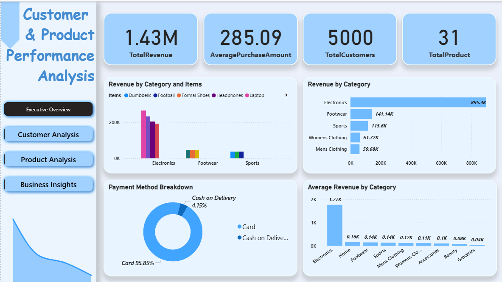
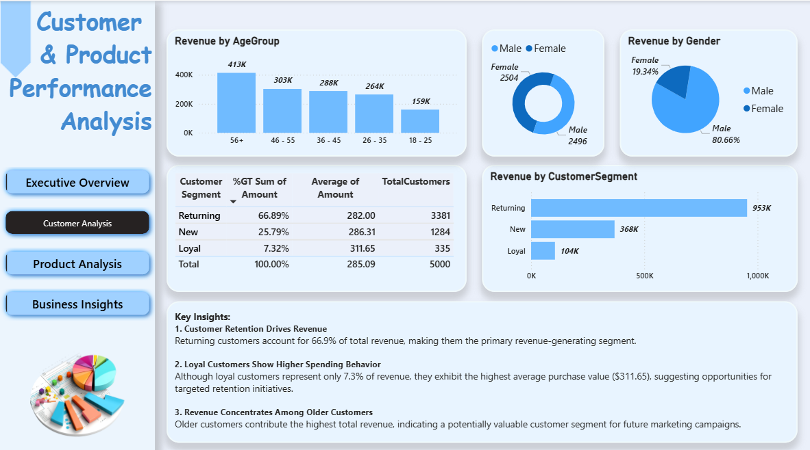
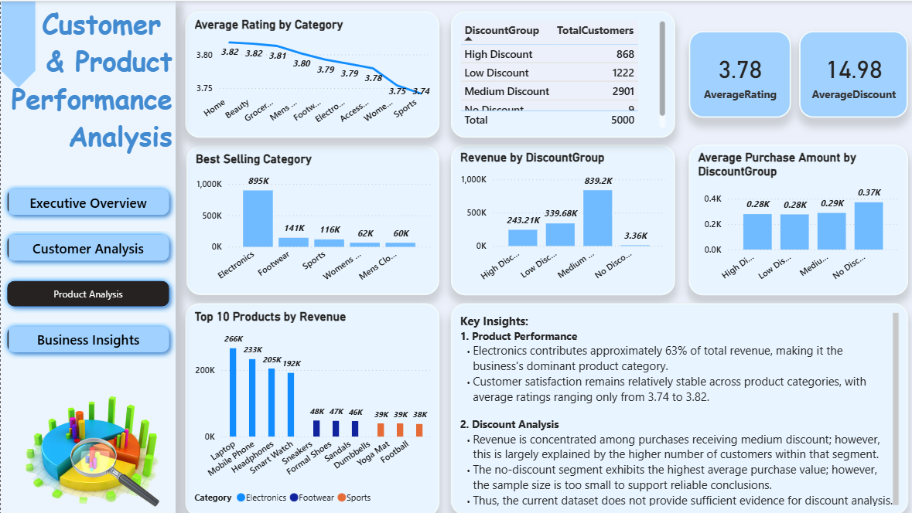

# Customer & Product Performance Analysis

## Project Overview
This Power BI project analyzes 5,000 customer purchase records to identify customer behavior, product performance, and discount effectiveness.

## Objectives
- Which customer segments drive revenue?
- Which product categories contribute most to revenue?
- How do discounts relate to customer spending?
- What opportunities exist for retention and growth?

## Tools Used
- Power BI
- Power Query
- DAX
- Data Modeling

## Skills Used
- Data Cleaning
- Data Modeling
- Power Query
- DAX
- Customer Segmentation
- Business Analysis
- Dashboard Design
- Data Visualization & Storytelling

## Key Insights
- Male customers and older age groups contribute the highest revenue.
- Returning customers generate 66.9% of total revenue.
- Loyal customers have the highest average purchase value.
- Electronics contributes approximately 63% of total revenue.
- Customer ratings remain consistent across product categories.
- Higher discounts do not necessarily lead to higher spending.

## Recommendations
- Strengthen Electronics category strategy.
- Improve performance of non-Electronics categories.
- Invest in loyalty and retention programs.
- Evaluate discount effectiveness with more detailed data.

## Limitations
- One record per customer.
- No transaction history available for customer lifetime value analysis.
- No date field for trend analysis.
- Correlation does not imply causation.

## Dashboard Preview
### Executive Overview

### Customer Analysis

### Product Analysis

## Repository Structure
- [Download Power BI File](customer-and-product-performance-analysis.pbix)
- [01-executive_overview.png](01-executive-overview.png)
- [02-customer-analysis.png](02-customer-analysis.png)
- [03-product-analysis.png](03-product-analysis.png)
